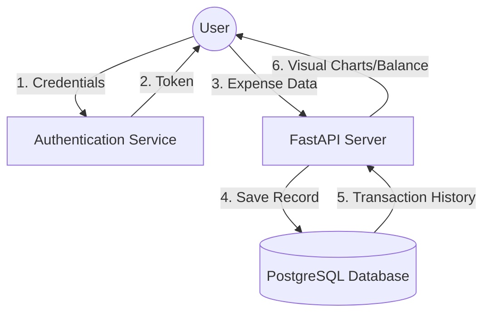

# 16 - Data Flow Diagram (DFD)

This diagram shows how data flows through the **Personal Expense Tracker** system.

### Flow Explanation:
1. **User Auth:** User provides login info; system returns a secure token.
2. **Transaction Entry:** User sends expense details (Amount, Category).
3. **Data Storage:** Backend saves the data into the PostgreSQL database.
4. **Data Retrieval:** Backend calculates the balance and generates charts from DB records.
5. **UI Update:** User sees their updated dashboard in the web browser.
