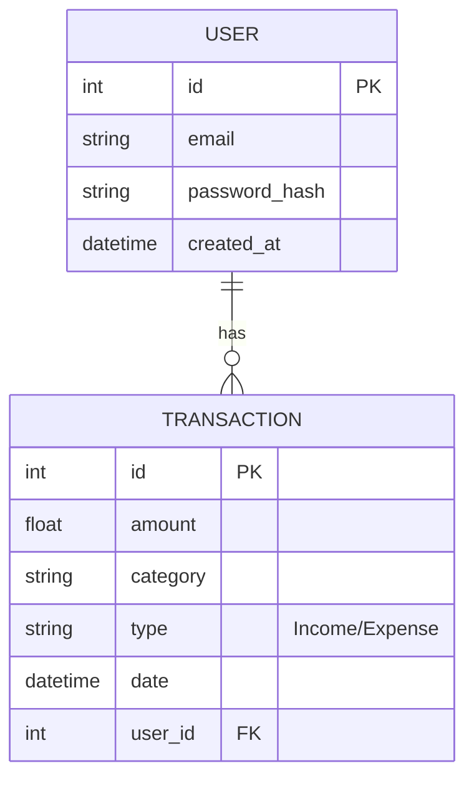

# 18 - Entity Relationship Diagram (ERD)

This diagram represents the database structure for the **Personal Expense Tracker**.

### Entity Details:
1. **USER:** Stores authentication and profile data. 
    - One user can have many transactions.
2. **TRANSACTION:** Stores the individual logs.
    - Each transaction is linked to exactly one user via `user_id`.
