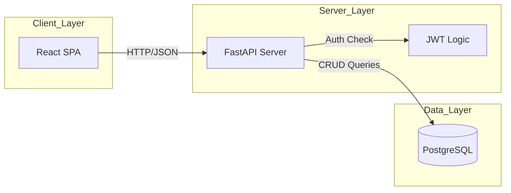

# 19 - System Design (Architecture)

The **Personal Expense Tracker** follows a classic 3-tier architecture.

### Components:
1. **Frontend (React):** Handles the user interface, routing, and data visualization (Pie Charts).
2. **Backend (FastAPI):** Handles business logic, data validation, and serves JSON data.
3. **Database (PostgreSQL):** Stores users and transaction history persistently.
4. **Authentication:** Using JWT (JSON Web Tokens) for secure session management.
