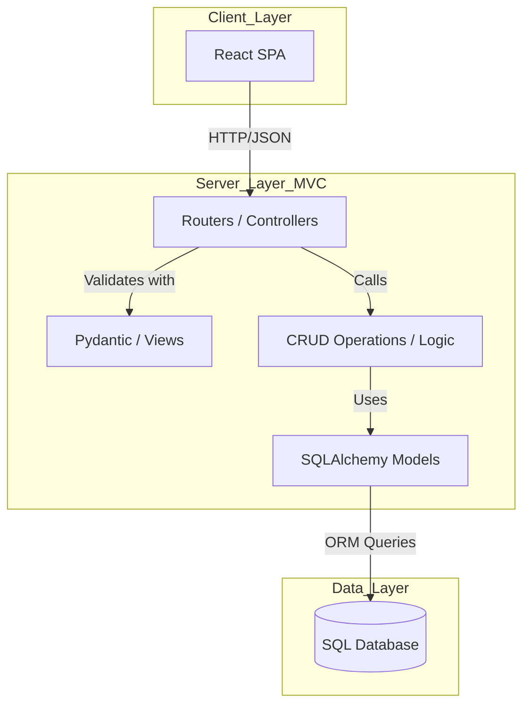

# 19 - System Design (Architecture)

The **Personal Expense Tracker** follows a classic 3-tier architecture with an MVC pattern in the backend.

### Components:
1. **Frontend (React):** Handles the user interface, routing, and data visualization (Pie Charts).
2. **Backend (FastAPI - MVC Pattern):** 
   - **Controllers (Routers):** Handles incoming HTTP requests and routes them.
   - **Views (Schemas):** Validates and formats the data sent and received.
   - **Models:** Represents database tables and logic using SQLAlchemy and CRUD functions.
3. **Database (SQLite/PostgreSQL):** Stores users and transaction history persistently.
4. **Authentication:** Uses secure token-based session management.
