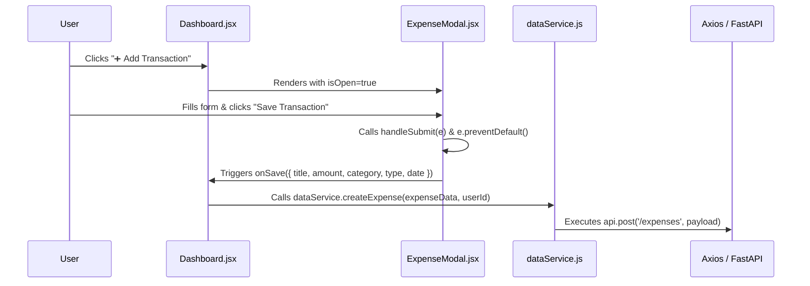

# 📚 Personal Expense Tracker — Full-Stack Technical Defense & System Architecture Guide

This document provides a line-by-line technical defense walkthrough for the **Personal Expense Tracker** full-stack application (React 18 + Vite Frontend & FastAPI + SQLAlchemy MVC Backend). The primary feature demonstrated throughout this guide is **"Add & Manage Expense Transactions"**.

---

## 1. ⚛️ React Frontend

### Which React component contains this feature?
The **Add / Edit Expense** feature is encapsulated inside the modal component [`ExpenseModal.jsx`](file:///c:/Users/Arpy/OneDrive/Documents/New%20folder/web_development_project/web_development_project/Frontend/src/components/ExpenseModal.jsx). It is rendered conditionally by the parent container page component [`Dashboard.jsx`](file:///c:/Users/Arpy/OneDrive/Documents/New%20folder/web_development_project/web_development_project/Frontend/src/pages/Dashboard.jsx).

### Explain the component hierarchy for this feature.
```
App.jsx (Root Router & Entry Point)
 └── Dashboard.jsx (Page Container / Main State Holder)
      ├── Navbar.jsx (Navigation Header)
      ├── ExpenseChart.jsx (Visual Recharts Analytics)
      └── ExpenseModal.jsx (Form Modal for Adding/Editing Expenses)
```

### Which function is executed when the user interacts with this feature?
1. **Trigger Modal Opening:** `openAddModal()` or `openEditModal(transaction)` in [`Dashboard.jsx`](file:///c:/Users/Arpy/OneDrive/Documents/New%20folder/web_development_project/web_development_project/Frontend/src/pages/Dashboard.jsx#L100-L108).
2. **Form Submission:** `handleSubmit(e)` in [`ExpenseModal.jsx`](file:///c:/Users/Arpy/OneDrive/Documents/New%20folder/web_development_project/web_development_project/Frontend/src/components/ExpenseModal.jsx#L30-L33).
3. **Data Saver Callback:** `handleSave(expenseData)` in [`Dashboard.jsx`](file:///c:/Users/Arpy/OneDrive/Documents/New%20folder/web_development_project/web_development_project/Frontend/src/pages/Dashboard.jsx#L60-L73).
4. **API Request Dispatcher:** `dataService.createExpense(expenseData, user.id)` in [`dataService.js`](file:///c:/Users/Arpy/OneDrive/Documents/New%20folder/web_development_project/web_development_project/Frontend/src/dataService.js#L80-L101).

### Walk me through the frontend flow from the user action until the API request is sent.


### Which React hooks did you use and why?
- `useState`:
  - In `ExpenseModal.jsx`: Tracks local controlled form inputs (`title`, `amount`, `category`, `type`, `date`).
  - In `Dashboard.jsx`: Tracks global state (`transactions`, `isModalOpen`, `expenseToEdit`, `user`, `searchQuery`, `categoryFilter`, `sortBy`).
- `useEffect`:
  - In `Dashboard.jsx`: Executes initial authentication check and fetches user transaction data upon component mounting.
  - In `ExpenseModal.jsx`: Synchronizes form input states whenever `expenseToEdit` or `isOpen` prop changes (populates fields for editing or clears them for a new transaction).
- `useNavigate` (React Router): Redirects unauthenticated users to `/login`.

### How is state managed for this feature?
- **Controlled Components:** Local input state lives inside `ExpenseModal.jsx`.
- **Lifting State Up:** `Dashboard.jsx` acts as the source of truth for all transactions. The child component (`ExpenseModal.jsx`) receives handler callbacks (`onSave`, `onClose`) as props and sends input payloads up to the parent.
- **Persistence:** User session metadata and application storage mode preferences (`local` vs `api`) are persisted in browser `localStorage`.

### How do you validate user input?
1. **HTML5 Native Constraints:** `required` on Title/Amount/Date inputs; `type="number"`, `min="0"`, `step="0.01"` on Amount.
2. **Frontend Type Coercion:** `amount: parseFloat(amount)` converts string inputs to floating point numbers before payload dispatch.
3. **Backend Schema Validation:** FastAPI uses Pydantic schemas ([`ExpenseCreate`](file:///c:/Users/Arpy/OneDrive/Documents/New%20folder/web_development_project/web_development_project/Backend/schemas/expense.py#L12-L13)) to enforce strict field types, non-null requirements, and ISO date parsing.

### How do you handle loading states?
Async operations inside `Dashboard.jsx` (`fetchTransactions`, `handleSave`) use `try...catch` blocks to capture API execution states. Buttons indicate current actions, and upon resolution, the modal automatically closes (`setIsModalOpen(false)`) while triggers refresh the dashboard transaction list.

---

## 2. 🌐 Browser DevTools

### DevTools Network Inspection Steps:
1. Open Chrome DevTools (`F12` or `Right Click -> Inspect -> Network`).
2. Select the **Network** tab and filter by **Fetch/XHR**.
3. Click "➕ Add Transaction", fill out the details, and click "Save Transaction".
4. Locate the HTTP request entry named `expenses`.

### Captured Request Details:
| Field | Value |
| :--- | :--- |
| **Request URL** | `http://localhost:8000/expenses` (or `https://web-development-project-shzj.onrender.com/expenses`) |
| **HTTP Method** | `POST` |
| **HTTP Status Code**| `200 OK` |
| **Response Time** | `~15 ms` (Local) / `~180 ms` (Cloud Server) |

#### Request Headers:
```http
Content-Type: application/json
Accept: application/json, text/plain, */*
Origin: http://localhost:5173
```

#### Request Payload:
```json
{
  "title": "Supermarket Groceries",
  "amount": 154.20,
  "category": "Food",
  "type": "Expense",
  "date": "2026-07-22",
  "user_id": 1
}
```

#### Server Response:
```json
{
  "id": 12,
  "user_id": 1,
  "title": "Supermarket Groceries",
  "amount": 154.20,
  "category": "Food",
  "type": "Expense",
  "date": "2026-07-22"
}
```

---

## 3. 🛠️ React Developer Tools & Profiler

### Component Hierarchy View:
```tsx
<Dashboard>
  <Navbar user={user} />
  <ExpenseChart transactions={transactions} />
  <ExpenseModal 
    isOpen={true} 
    expenseToEdit={null} 
    onClose={function} 
    onSave={function} 
  />
</Dashboard>
```

### React Profiler Recording Workflow:
1. Open **React Developer Tools** -> **Profiler** tab.
2. Click the **Record (Circle)** icon.
3. Submit a new expense inside the `ExpenseModal`.
4. Click **Stop Recording**.
5. Analyze render durations: Inspect component commit phases in the **Flamegraph**. Notice that only `<Dashboard>` and `<ExpenseModal>` re-render during state updates.

---

## 4. ⚙️ Backend Architecture (FastAPI MVC)

### Request Flow (React → FastAPI → Database → React)
```
[React App] -> Axios HTTP POST -> [FastAPI Router: expense_routes.py]
                                         │
                                 Pydantic Validation (ExpenseCreate)
                                         │
                                         ▼
                               [Controller: expense_controller.py]
                                         │
                                  SQLAlchemy ORM
                                         │
                                         ▼
                               [Database: SQLite / expense_tracker.db]
                                         │
                               Row Inserted & Returned
                                         │
                                         ▼
                               [Pydantic Schema: ExpenseOut]
                                         │
                                 HTTP 200 OK JSON Response
                                         │
                                         ▼
[React Dashboard] <- Update Transactions State <- Axios Promise Resolved
```

### Layer Responsibilities in Codebase:

| Component | File Path | Responsibility |
| :--- | :--- | :--- |
| **Router** | [`expense_routes.py`](file:///c:/Users/Arpy/OneDrive/Documents/New%20folder/web_development_project/web_development_project/Backend/routes/expense_routes.py) | Endpoints, URL route definitions, HTTP status codes & dependency injection (`get_db`). |
| **Controller** | [`expense_controller.py`](file:///c:/Users/Arpy/OneDrive/Documents/New%20folder/web_development_project/web_development_project/Backend/controllers/expense_controller.py) | Business logic execution, CRUD operations, database session queries. |
| **Model** | [`models/expense.py`](file:///c:/Users/Arpy/OneDrive/Documents/New%20folder/web_development_project/web_development_project/Backend/models/expense.py) | SQLAlchemy database table definition and mapping. |
| **Schema** | [`schemas/expense.py`](file:///c:/Users/Arpy/OneDrive/Documents/New%20folder/web_development_project/web_development_project/Backend/schemas/expense.py) | Pydantic data serialization, validation, and request/response typing. |

### Why separate Router, Controller, Service, and Model layers?
1. **Separation of Concerns (SoC):** Routers handle HTTP protocol details; Controllers handle domain logic; Models handle data representation.
2. **Reusability & Testability:** Controllers can be unit tested without starting an HTTP web server.
3. **Maintainability:** Modifying database models does not require altering endpoint URLs or validation rules.

---

## 5. 🔌 API & Endpoint Specifications

- **Endpoint:** `POST /expenses`
- **HTTP Method Choice:** `POST` is used because creating a transaction creates a new resource on the server with an auto-generated server ID (`id`).
- **HTTP Status Codes:**
  - `200 OK` (Successful creation/response)
  - `400 Bad Request` (Invalid business input)
  - `404 Not Found` (Updating/deleting non-existent expense ID)
  - `422 Unprocessable Entity` (Pydantic schema validation failure)
  - `500 Internal Server Error` (Database connection failure)

---

## 6. 🧪 cURL & Postman Execution

### cURL Command:
```bash
curl -X 'POST' \
  'http://localhost:8000/expenses' \
  -H 'accept: application/json' \
  -H 'Content-Type: application/json' \
  -d '{
  "title": "Uber Taxi Rides",
  "amount": 45.5,
  "category": "Transport",
  "type": "Expense",
  "date": "2026-07-22",
  "user_id": 1
}'
```

### Command Breakdown:
- `-X 'POST'`: Specifies HTTP method as `POST`.
- `-H 'Content-Type: application/json'`: Informs server that the payload is formatted as JSON.
- `-d '{...}'`: Passes raw JSON payload.

### Postman Execution & Edge Cases:

1. **Valid Data Execution:** Returns `200 OK` with generated `id`.
2. **Missing Required Data (e.g., omitting `"amount"`):**
   - **Response Code:** `422 Unprocessable Entity`
   - **Body:**
     ```json
     {
       "detail": [
         {
           "loc": ["body", "amount"],
           "msg": "field required",
           "type": "value_error.missing"
         }
       ]
     }
     ```
3. **Invalid Data Format (e.g., `"amount": "invalid_number"`):**
   - FastAPI automatically rejects the payload with a `422 Unprocessable Entity` status code explaining type mismatch.

---

## 7. 🗄️ Database & Schema Design

### Database Tables Involved:
- `expenses` (Main table)
- `users` (Parent table referenced via Foreign Key)

### Database Schema Definition:
```sql
CREATE TABLE expenses (
    id INTEGER PRIMARY KEY AUTOINCREMENT,
    user_id INTEGER NOT NULL,
    title VARCHAR NOT NULL,
    amount FLOAT NOT NULL,
    category VARCHAR NOT NULL,
    type VARCHAR NOT NULL,
    date DATE NOT NULL,
    FOREIGN KEY(user_id) REFERENCES users(id)
);
```

### SQLAlchemy Model ([`models/expense.py`](file:///c:/Users/Arpy/OneDrive/Documents/New%20folder/web_development_project/web_development_project/Backend/models/expense.py)):
```python
class Expense(Base):
    __tablename__ = "expenses"
    
    id = Column(Integer, primary_key=True, index=True)
    user_id = Column(Integer, ForeignKey("users.id"), index=True)
    title = Column(String, index=True)
    amount = Column(Float)
    category = Column(String, index=True)
    type = Column(String) # 'Income' or 'Expense'
    date = Column(Date)
```

### Handling Missing Records:
In [`expense_routes.py`](file:///c:/Users/Arpy/OneDrive/Documents/New%20folder/web_development_project/web_development_project/Backend/routes/expense_routes.py#L18-L23), if an operation targets a non-existent `expense_id`, the controller returns `None`, and the router explicitly raises a 404 exception:
```python
if not updated_expense:
    raise HTTPException(status_code=404, detail="Expense not found")
```

---

## 8. 🔍 Line-by-Line Code Breakdown

### Backend Controller Function ([`expense_controller.py`](file:///c:/Users/Arpy/OneDrive/Documents/New%20folder/web_development_project/web_development_project/Backend/controllers/expense_controller.py#L8-L13)):

```python
def create_expense(db: Session, expense: ExpenseCreate):
    db_expense = Expense(**expense.model_dump())
    db.add(db_expense)
    db.commit()
    db.refresh(db_expense)
    return db_expense
```

1. `def create_expense(db: Session, expense: ExpenseCreate):`: Declares function accepting a database session and validated Pydantic expense schema.
2. `db_expense = Expense(**expense.model_dump())`: Converts Pydantic model to Python dictionary using `.model_dump()` and unpacks it (`**`) to instantiate a SQLAlchemy `Expense` model instance.
3. `db.add(db_expense)`: Adds new object to current database transaction session tracking queue.
4. `db.commit()`: Writes changes permanently to SQLite database file.
5. `db.refresh(db_expense)`: Reloads instance attributes from database (assigns primary key `id`).
6. `return db_expense`: Returns ORM model instance (which Pydantic automatically serializes into JSON).

---

## 9. 🚀 Future Architectural Improvements

If granted additional development time, the following production enhancements would be added:
1. **JWT Bearer Token Authentication:** Replace `user_id` query parameters with secure JWT tokens sent via HTTP `Authorization: Bearer <token>` headers.
2. **Server-side Pagination & Searching:** Implement `limit` and `offset` parameters on `GET /expenses` for high-volume transactions.
3. **Optimistic UI Updates:** Immediately render newly created items in React state before waiting for the API response to complete.
4. **Automated Unit & E2E Testing:** Implement pytest backend test suites and Cypress / Playwright E2E frontend automation.
